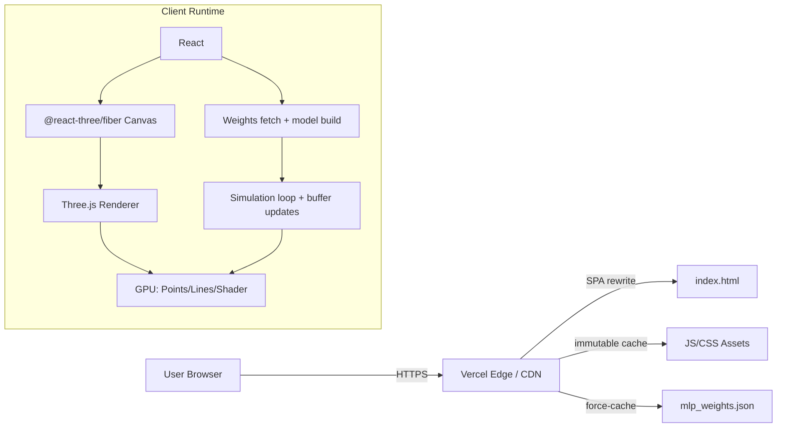
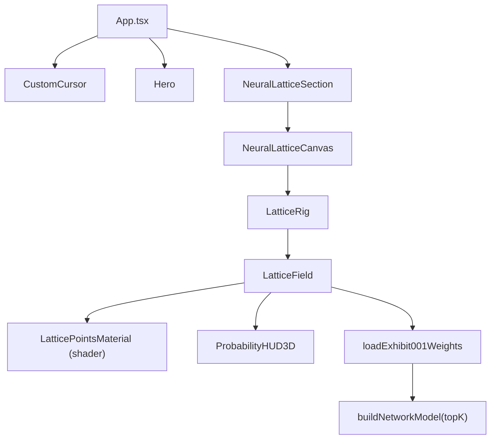
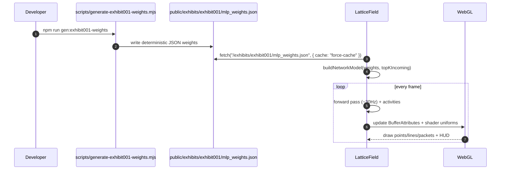
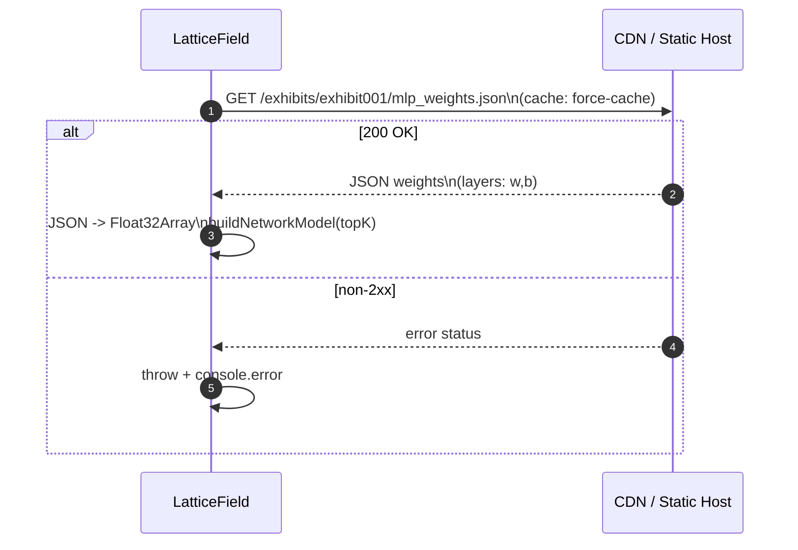
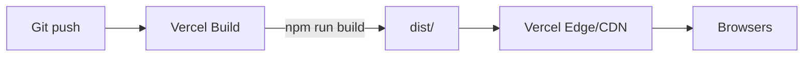

<div align="center">

<h1>Andrew Ponder — Portfolio</h1>

<p>
  Production-grade <strong>Vite + React + TypeScript</strong> portfolio featuring <strong>EXHIBIT 001</strong>: a GPU-accelerated
  <strong>neural-lattice</strong> visualization driven by deterministic MLP weights and a real-time Three.js simulation loop.
</p>

<br/>


<br/>


<br/>


<br/>

<table style="border: 1px solid rgba(255,255,255,0.08); border-radius: 12px;">
  <tr>
    <td align="left">
      <strong>Runtime</strong><br/>
      <sub>React + R3F + Three.js (WebGL)</sub>
    </td>
    <td align="left">
      <strong>Artifact</strong><br/>
      <sub>Deterministic MLP weights → graph model</sub>
    </td>
    <td align="left">
      <strong>Delivery</strong><br/>
      <sub>Vercel CDN + immutable caching</sub>
    </td>
  </tr>
</table>

<br/>

</div>

---

## About

This repository is a modern, production-ready **frontend** built for **high-end interaction** and **visual storytelling**.

- **What it does**: Ships a fast portfolio SPA with an interactive 3D exhibit (**EXHIBIT 001 — Neural Lattice**) that visualizes a small feed-forward MLP as an animated graph.
- **Problem it solves**: Demonstrates real engineering execution (render loop, deterministic assets, performance gating, accessibility fallbacks) while delivering a premium UX.
- **Built for**: Engineering teams, recruiters, and product-minded collaborators evaluating **frontend architecture**, **rendering performance**, and **interaction design**.
- **Why it matters**: This isn’t a “static site with animations” — the exhibit is a miniature real-time system with **typed-array data structures**, **GPU shader materials**, and **runtime quality controls**.

---

## Key Features

- **GPU-accelerated neural lattice renderer** — Three.js scene driven by a real simulation loop (nodes, edges, packets, and 3D HUD).
- **Deterministic data artifact pipeline** — a Node script generates reproducible MLP weight files used by the runtime visualization.
- **Adaptive quality scaling** — dynamically selects render quality based on device DPR and CPU cores; controls DPR, fog, antialiasing, and particle budgets.
- **Accessibility-first motion model** — honors `prefers-reduced-motion` by switching the canvas to demand-driven rendering and disabling heavy simulation.
- **Interactive input-plane raycasting** — pointer intersection is computed against an input plane and translated into activation “brush strokes”.
- **Shader-based node material** — custom point shader controls intensity, halos, and ignition sequencing without per-frame React churn.
- **Performance-oriented build output** — manual vendor chunking, Terser console stripping, and immutable asset caching headers for CDN delivery.
- **Operationally clean deployment** — Vercel SPA rewrites + long-lived caching for static assets.

---

## Tech Stack

### Languages


### Frontend


### 3D / Rendering


### Tooling


### Deployment / Infrastructure


---

## Architecture

At runtime this is a **static SPA** plus an internal “mini-engine” that:

- loads a deterministic weights artifact (`/public/exhibits/exhibit001/mlp_weights.json`)
- converts weights → graph topology (**top‑K incoming edges per neuron**)
- runs a throttled forward pass (~30Hz) and writes results into GPU-friendly buffers
- renders nodes/edges/packets/HUD with additive blending and a custom shader material

### System architecture



### Component layout (runtime)



### Weights → model → render lifecycle



### Performance & reliability notes

- **Throttled compute**: the forward pass is rate-limited to ~30Hz while rendering can stay smooth.
- **Typed arrays everywhere**: node positions, edges, colors, activities, packet state are stored in `Float32Array`/`Uint32Array` to reduce allocations and improve locality.
- **Top‑K edges**: the graph stays legible and bounded (reduces draw + update cost).
- **Reduced motion mode**: switches to `frameloop="demand"` and gates heavy simulation.
- **CDN caching**: `vercel.json` sets immutable caching for build assets.

---

## Documentation & Deep Examples

### 1) Generate deterministic weights (artifact pipeline)

```bash
npm run gen:exhibit001-weights
```

Output file:

- `public/exhibits/exhibit001/mlp_weights.json`

The generator uses a deterministic PRNG (`mulberry32(1337)`) so the artifact is reproducible across machines.

### 2) Load weights (runtime)

```ts
// src/components/exhibits/neural-lattice/neuralLattice.ts
export async function loadExhibit001Weights() {
  const res = await fetch("/exhibits/exhibit001/mlp_weights.json", { cache: "force-cache" });
  if (!res.ok) throw new Error(`Failed to load weights: ${res.status}`);
  // ...convert JSON arrays -> Float32Array
}
```

### 3) Build a graph model from weights (top‑K compression)

The runtime converts dense weight matrices into a sparse, visual-friendly graph.

```ts
// src/components/exhibits/neural-lattice/LatticeField.tsx
const topK = quality === "high" ? 6 : quality === "medium" ? 5 : 4;
setModel(buildNetworkModel(weights, topK));
```

### 4) Input interaction model (pointer → input plane → activations)

- Pointer is raycasted against an **input plane** at `x = -3.2`.
- The local pointer coordinates are used as an activation “brush” across the 8×8 input grid.

```ts
// inside LatticeField frame loop
const p = pointerOnInputPlaneRef.current;
for (let i = 0; i < inputCount; i++) {
  const idx = inputStart + i;
  const dy = positions[idx * 3 + 1] - p.y;
  const dz = positions[idx * 3 + 2] - p.z;
  const target = Math.exp(-(dy * dy + dz * dz) / 0.06);
  a0.current[i] = THREE.MathUtils.damp(a0.current[i], target, 10.0, delta);
}
```

### 5) Runtime “API”: static asset endpoints

Even though this is a frontend-only app, there is a real interface surface: the app fetches versioned assets from the CDN (documented below under **API Documentation**).

### 6) Keyboard shortcuts

| Key | Action |
|---:|---|
| `h` | Scroll to hero section |
| `l` | Scroll to Neural Lattice section |
| `?` | Show shortcut dialog |

### 7) Configuration / environment

No runtime environment variables are required for local dev or deployment.

| Variable | Required | Default | Description |
|---|---:|---|---|
| _(none)_ | No | — | Static SPA + assets |

---

## Getting Started

### Prerequisites

- **Node.js**: 18+ (recommended)
- **npm**: 9+
- **OS**: Windows/macOS/Linux

### Installation

```bash
npm install
```

### Local development

```bash
npm run dev
```

- Vite dev server: `http://localhost:5173`

### Type-checking & linting

```bash
npm run type-check
npm run lint
```

### Production build

```bash
npm run build
npm run preview
```

---

## API Documentation

This project does **not** expose a backend API. The “API surface” is a **static asset contract** consumed by the exhibit runtime.

### Endpoint summary

| Endpoint | Method | Purpose | Cache model |
|---|---:|---|---|
| `/exhibits/exhibit001/mlp_weights.json` | GET | MLP weights artifact for Exhibit 001 | Requested with `cache: force-cache`; served via CDN |

### Request / response example

```bash
curl -sS "http://localhost:5173/exhibits/exhibit001/mlp_weights.json" | head
```

Response shape (high level):

```json
{
  "name": "exhibit001_mlp_demo_v1",
  "createdAt": "2025-…",
  "note": "Deterministic demo weights for Exhibit 001 visualization.",
  "layers": [
    { "in": 64, "out": 48, "w": [/* ... */], "b": [/* ... */] },
    { "in": 48, "out": 24, "w": [/* ... */], "b": [/* ... */] },
    { "in": 24, "out": 10, "w": [/* ... */], "b": [/* ... */] }
  ]
}
```

### Error handling

- **Non-2xx responses**: the runtime throws `Failed to load weights: <status>` and logs the error in the console.
- **Common causes**: missing artifact (weights not generated/committed), misconfigured static hosting, or a broken rewrite rule.

### Auth & rate limits

- **Auth**: none (public static asset).
- **Rate limits**: none implemented at the app level (CDN/host policies apply).

### API lifecycle (runtime sequence)



---

## Production Deployment

This repo is configured for **Vercel**.

- **Build command**: `npm run build`
- **Output directory**: `dist`
- **SPA routing**: `vercel.json` rewrites all routes to `index.html`
- **Cache headers**: immutable caching for `/assets/*` and `*.js`

If you use a custom domain, `CNAME` is present for DNS configuration.



---

## Project Structure

```text
.
├── index.html
├── package.json
├── vite.config.ts              # Vite config (alias @ -> src, manualChunks)
├── vercel.json                 # SPA rewrites + immutable cache headers
├── scripts/
│   └── generate-exhibit001-weights.mjs   # Deterministic MLP weight generator
├── public/
│   └── exhibits/
│       └── exhibit001/
│           └── mlp_weights.json         # Generated weights artifact (runtime fetch)
└── src/
    ├── main.tsx                # React entry
    ├── App.tsx                 # App composition
    ├── components/
    │   ├── hero/                # Boot sequence + hero UI
    │   ├── ui/                  # Cursor + UI primitives
    │   └── exhibits/
    │       └── neural-lattice/  # Exhibit 001 runtime (3D + sim)
    ├── hooks/                   # Visual quality + reduced motion + shortcuts
    └── styles/
        └── globals.css          # Global styling + Exhibit 001 visuals
```

---

## License

MIT — see `LICENSE`.
