# Andrew Ponder Portfolio

Modern, cyberpunk-themed portfolio showcasing web development and design work with advanced UI/UX interactions.

[](https://opensource.org/licenses/MIT)
[](https://www.typescriptlang.org/)
[](https://reactjs.org/)
[](https://vitejs.dev/)

🔗 **Live:** [andrewponder.com](https://andrewponder.com)

---

## Table of Contents

- [Exhibits](#exhibits)
- [Features](#features)
- [Tech Stack](#tech-stack)
- [Quick Start](#quick-start)
  - [Prerequisites](#prerequisites)
  - [Installation](#installation)
  - [Environment Variables](#environment-variables)
  - [Run Development](#run-development)
  - [Build for Production](#build-for-production)
- [Scripts](#scripts)
- [Project Structure](#project-structure)
- [Architecture](#architecture)
- [Key Features Implementation](#key-features-implementation)
- [Configuration](#configuration)
- [Deployment](#deployment)
- [Troubleshooting](#troubleshooting)
- [License](#license)

---

## Exhibits

The portfolio is built as a series of **Exhibits** — standalone Three.js/R3F experiences that showcase creative development skills.

### EXHIBIT_001 — Neural Lattice
Location: `src/components/exhibits/neural-lattice/`

An ambient node network rendered with React Three Fiber:
- **Visuals:** Indigo/cyan color palette with additive glow
- **Interaction:** Subtle parallax + proximity-based node activation
- **Performance:** Quality tiers (low/medium/high) based on device capabilities
- **Accessibility:** Respects `prefers-reduced-motion`, touch fallback for mobile

> **Note:** Current site renders **Hero + EXHIBIT_001 only**; other sections (projects, skills, about, contact) are intentionally not rendered during the exhibit development phase.

---

## Features

All features verified from source code (`src/`):

### UI/UX
- **Custom Cursor System** - Multi-state animated cursor with trail effects and context-aware styling (link, button, card, drag states) - `src/components/ui/CustomCursor.tsx`
- **Boot Sequence Animation** - System initialization animation on page load - `src/components/hero/BootSequence.tsx`
- **3D Particle Background** - Three.js-powered animated particle field with 2000+ particles - `src/components/hero/ParticleBackground.tsx`
- **Loading Screen** - Progress bar with percentage indicator and corner brackets - `src/components/ui/LoadingScreen.tsx`
- **Scroll Progress Indicator** - Top-fixed progress bar with spring physics - `src/components/ui/ScrollProgress.tsx`
- **Keyboard Navigation** - Shortcuts for quick section navigation (h/p/s/a/c, ? for help, ESC to close modals) - `src/hooks/useKeyboardShortcuts.ts`
- **Grid Overlay** - Technical cyberpunk aesthetic grid - `src/components/layout/GridOverlay.tsx`
- **Corner Brackets** - Reusable UI element for framing content - `src/components/ui/CornerBrackets.tsx`

### Content Sections
- **Hero Section** - Full-screen introduction with status indicators and scroll prompt - `src/components/hero/`
- **Projects Grid** - 4 featured projects with modal details, tech stack, and links - `src/components/projects/ProjectsSection.tsx`
- **Skills Visualization** - Animated skill bars across 4 categories (Frontend, Backend, Tools, AI) - `src/components/skills/SkillsSection.tsx`
- **About Section** - Personal bio and background - `src/components/about/AboutSection.tsx`
- **Contact Form** - EmailJS-integrated form with validation and status feedback - `src/components/contact/ContactForm.tsx`
- **Social Links** - GitHub, LinkedIn, Email with animated icons - `src/components/contact/SocialLinks.tsx`

### State & Data
- **Zustand Store** - Global project state management - `src/stores/projectStore.ts`
- **4 Project Entries** - Web Agency, AI Advisor, Lead Generator, Theory Validator - with codenames, status, tech stacks, and GitHub links

### Performance
- **Code Splitting** - Manual chunks for React, Framer Motion, and Three.js - `vite.config.ts:29-33`
- **Optimized Build** - Terser minification, console removal, ES2015 target - `vite.config.ts:16-40`
- **Font Preconnect** - Google Fonts optimized loading - `index.html:33-34`

### SEO & Accessibility
- **Meta Tags** - OpenGraph, Twitter Card, structured data - `index.html:7-28`
- **Sitemap & Robots.txt** - Search engine optimization - `public/sitemap.xml`, `public/robots.txt`
- **Semantic HTML** - Proper section IDs for navigation
- **Reduced Motion Support** - Respects `prefers-reduced-motion` - `src/utils/animations.ts:31-48`

---

## Tech Stack

### Core
- **Runtime:** Node.js (18+)
- **Framework:** React 18.2
- **Language:** TypeScript 5.3
- **Build Tool:** Vite 5.0
- **Package Manager:** npm

### UI Libraries
- **Animation:** Framer Motion 11.0, GSAP 3.12
- **3D Graphics:** Three.js 0.160, @react-three/fiber 8.15, @react-three/drei 9.96
- **Styling:** Tailwind CSS 3.4, PostCSS 8.4, Autoprefixer 10.4

### State & Data
- **State Management:** Zustand 4.5.7

### Tooling
- **Linting:** ESLint 8.56, @typescript-eslint/eslint-plugin 6.0
- **Formatting:** Prettier 3.2
- **Type Checking:** TypeScript strict mode

### Deployment
- **Platform:** Vercel
- **Domain:** andrewponder.com (CNAME)
- **Email Service:** EmailJS (configured)

---

## Quick Start

### Prerequisites

```bash
node >= 18.0.0
npm >= 9.0.0
```

### Installation

```bash
# Clone repository
git clone https://github.com/ponderrr/portfolio.git
cd portfolio

# Install dependencies
npm install
```

### Environment Variables

Create `.env` from `env.example`:

```bash
cp env.example .env
```

| Variable | Description | Required | Default |
|----------|-------------|----------|---------|
| `VITE_EMAILJS_SERVICE_ID` | EmailJS service identifier | Yes | - |
| `VITE_EMAILJS_TEMPLATE_ID` | EmailJS email template ID | Yes | - |
| `VITE_EMAILJS_PUBLIC_KEY` | EmailJS public API key | Yes | - |
| `VITE_GA_MEASUREMENT_ID` | Google Analytics 4 measurement ID | No | - |
| `VITE_API_URL` | External API base URL (if needed) | No | - |

**Note:** EmailJS configuration is required for contact form functionality. Sign up at [emailjs.com](https://www.emailjs.com/).

### Run Development

```bash
npm run dev
```

Server runs at `http://localhost:5173` (host: `0.0.0.0` for network access).

### Build for Production

```bash
# Type check + build
npm run build

# Preview production build locally
npm run preview
```

Build output: `dist/` directory.

---

## Scripts

Defined in `package.json`:

| Command | Action | Details |
|---------|--------|---------|
| `npm run dev` | Start dev server | Vite dev server with HMR on port 5173 |
| `npm run build` | Build for production | TypeScript compilation + Vite build |
| `npm run preview` | Preview production build | Serves `dist/` locally |
| `npm run lint` | Lint codebase | ESLint with TypeScript rules |
| `npm run type-check` | Type checking only | TypeScript check without emit |

---

## Project Structure

```
portfolio/
├── public/                    # Static assets
│   ├── favicon.svg
│   ├── robots.txt
│   └── sitemap.xml
├── src/
│   ├── components/           # React components
│   │   ├── about/           # About section
│   │   ├── base/            # Base UI (Button, Card, Container)
│   │   ├── contact/         # Contact form & social links
│   │   ├── hero/            # Hero section with boot, particles, navigation
│   │   ├── layout/          # Footer, grid overlay
│   │   ├── projects/        # Project grid, cards, modal
│   │   ├── skills/          # Skills visualization
│   │   └── ui/              # UI utilities (cursor, loading, scroll progress)
│   ├── hooks/               # Custom React hooks
│   │   ├── useKeyboardShortcuts.ts
│   │   ├── useMousePosition.ts
│   │   └── useScrollProgress.ts
│   ├── stores/              # Zustand state stores
│   │   └── projectStore.ts  # Project data & selected project
│   ├── styles/              # Global styles
│   │   └── globals.css
│   ├── types/               # TypeScript definitions
│   │   └── index.ts
│   ├── utils/               # Utility functions
│   │   ├── analytics.ts     # Google Analytics integration
│   │   ├── animations.ts    # Animation helpers
│   │   └── constants.ts     # Theme constants, skills data
│   ├── App.tsx              # Root component
│   ├── main.tsx             # Entry point
│   └── vite-env.d.ts        # Vite type definitions
├── .eslintrc.cjs            # ESLint config
├── .prettierrc              # Prettier config
├── postcss.config.js        # PostCSS config
├── tailwind.config.js       # Tailwind theme customization
├── tsconfig.json            # TypeScript config
├── vite.config.ts           # Vite build config
├── vercel.json              # Vercel deployment config
└── package.json             # Dependencies & scripts
```

---

## Architecture

```mermaid
graph TB
    subgraph "Entry Point"
        HTML[index.html] --> Main[main.tsx]
        Main --> App[App.tsx]
    end

    subgraph "Global UI Layer"
        App --> Loading[LoadingScreen]
        App --> Cursor[CustomCursor]
        App --> Progress[ScrollProgress]
        App --> Grid[GridOverlay]
        App --> Modal[ProjectModal]
    end

    subgraph "Content Sections"
        App --> Hero[Hero Section]
        App --> Projects[Projects Section]
        App --> Skills[Skills Section]
        App --> About[About Section]
        App --> Contact[Contact Section]
        App --> Footer[Footer]
    end

    subgraph "Hero Components"
        Hero --> Boot[BootSequence]
        Hero --> Particles[ParticleBackground]
        Hero --> HeroText[HeroText]
        Hero --> Status[StatusIndicators]
        Hero --> Nav[Navigation]
        Hero --> Scroll[ScrollIndicator]
    end

    subgraph "State Management"
        ProjectStore[Zustand Store] --> Projects
        ProjectStore --> Modal
    end

    subgraph "3D Rendering"
        Particles --> Three[Three.js Canvas]
        Three --> Points[2000 Particles]
    end

    subgraph "Hooks & Utils"
        Keyboard[useKeyboardShortcuts] --> App
        Analytics[analytics.ts] -.-> App
        Constants[constants.ts] --> Skills
        Constants --> Hero
    end

    subgraph "Contact Integration"
        Contact --> Form[ContactForm]
        Form --> EmailJS[EmailJS API]
    end

    style App fill:#ff4500,stroke:#ff6b35,color:#fff
    style ProjectStore fill:#1a1a1a,stroke:#ff4500
    style Three fill:#0a0a0a,stroke:#ff4500
    style EmailJS fill:#2a2a2a,stroke:#ff4500
```



---

## Key Features Implementation

### Custom Cursor
Location: `src/components/ui/CustomCursor.tsx`

Multi-state cursor with trail effects:
- **States:** default, link, button, card, drag, neural
- **Effects:** Smooth trailing, orbiting dots for neural state
- **Interactivity:** Detects `data-cursor` attributes, context-aware styling
- **Accessibility:** Disabled for touch devices and reduced motion preference

### Project Modal
Location: `src/components/projects/ProjectModal.tsx`

Slide-in panel with:
- Side panel animation (spring physics)
- ESC key to close
- Body scroll lock when open
- Scan line animation effect
- GitHub + live site links
- Feature list with animated checkmarks

### Keyboard Navigation
Location: `src/hooks/useKeyboardShortcuts.ts`

Shortcuts:
- `h` → Home (scroll to top)
- `l` → Neural Lattice exhibit
- `?` → Show shortcuts help
- `ESC` → Close modal

Disabled when typing in input fields.

### 3D Particle Background
Location: `src/components/hero/ParticleBackground.tsx`

Three.js implementation:
- 2000 particles positioned in 3D space
- Continuous rotation animation
- Orange theme color (#ff4500)
- Optimized with `frustumCulled={false}`

---

## Configuration

### Vite (`vite.config.ts`)

**Path Aliases:**
```typescript
'@/*' → './src/*'
```

**Server:**
- Host: `0.0.0.0` (network accessible)
- Port: `5173`

**Build Optimization:**
- Target: ES2015
- Minifier: Terser
- Console logs removed in production
- Manual chunks: `react-vendor`, `framer-motion`, `three`
- Source maps: disabled

### Tailwind (`tailwind.config.js`)

**Custom Theme:**
- **Colors:** Orange primary (#ff4500), black variants, gray scale
- **Fonts:** Space Grotesk (heading), Inter (body), JetBrains Mono (code)
- **Animations:** `glow-pulse` (2s), `scan-line` (2s)

### Vercel (`vercel.json`)

**Settings:**
- Output: `dist/`
- Framework: Vite
- SPA rewrites: All routes → `/index.html`
- Asset caching: 1 year immutable

**Headers:**
```json
/assets/*: Cache-Control: public, max-age=31536000, immutable
/*.js: Cache-Control: public, max-age=31536000, immutable
```

---

## Deployment

### Current Deployment

**Platform:** Vercel  
**URL:** https://andrewponder.com  
**Branch:** main (auto-deploy on push)

### Manual Deploy

```bash
# Build production bundle
npm run build

# Deploy to Vercel
vercel --prod
```

### Environment Variables on Vercel

Set in Vercel dashboard under **Settings → Environment Variables**:
- `VITE_EMAILJS_SERVICE_ID`
- `VITE_EMAILJS_TEMPLATE_ID`
- `VITE_EMAILJS_PUBLIC_KEY`
- `VITE_GA_MEASUREMENT_ID` (optional)

---

## Troubleshooting

### Build Errors

**Issue:** TypeScript errors during build
```bash
# Run type check separately to isolate errors
npm run type-check
```

**Issue:** Out of memory during build
```bash
# Increase Node memory limit
NODE_OPTIONS=--max-old-space-size=4096 npm run build
```

### Development Issues

**Issue:** Port 5173 already in use
```bash
# Kill process on port
# Windows PowerShell:
Get-Process -Id (Get-NetTCPConnection -LocalPort 5173).OwningProcess | Stop-Process

# Linux/Mac:
lsof -ti:5173 | xargs kill
```

**Issue:** Vite HMR not working
- Check firewall settings for port 5173
- Ensure `host: '0.0.0.0'` in `vite.config.ts`

**Issue:** Three.js performance degradation
- Check GPU acceleration in browser settings
- Reduce particle count in `ParticleBackground.tsx:9` if needed (default: 2000)

### EmailJS Configuration

**Issue:** Contact form not sending emails
1. Verify environment variables are set correctly
2. Check EmailJS dashboard for service status
3. Confirm template ID matches your EmailJS template
4. Test with EmailJS playground first

**Issue:** CORS errors with EmailJS
- Ensure domain is whitelisted in EmailJS dashboard
- Check public key is correctly set

### Performance

**Issue:** Slow initial load
- Check network tab for large assets
- Verify code splitting is working (`dist/assets/` should have separate chunks)
- Consider lazy loading Three.js components

**Issue:** Cursor lag
- Reduce trail points in `CustomCursor.tsx:24` (default: 8)
- Adjust spring damping/stiffness for less smooth animation

---

## License

MIT License - see [LICENSE](LICENSE) for details.

Copyright (c) 2025 Andrew Ponder

---

**Built with:** React + TypeScript + Vite + Three.js + Framer Motion  
**Deployed on:** Vercel  
**Design:** Cyberpunk aesthetic with orange accent (#ff4500)

